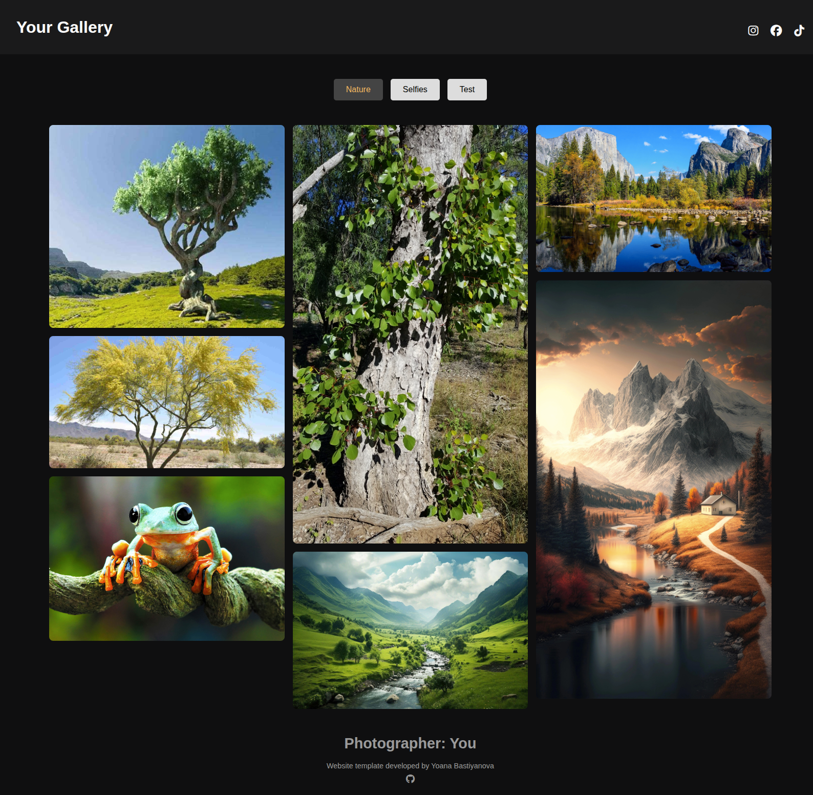
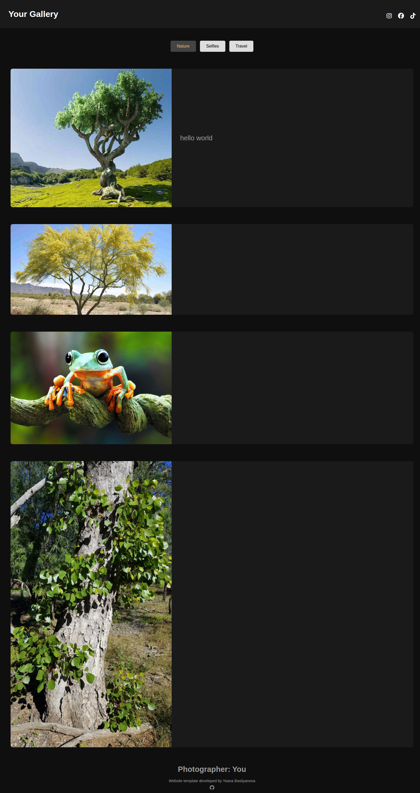
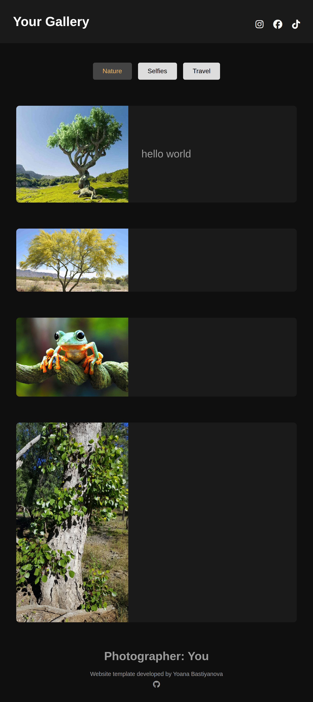

# Your Gallery

A self-hosted, no-backend photo gallery. Add photos through the GitHub website, and the site rebuilds itself automatically — no local setup, no build tools, no server required. 

It's totally free, but consider giving me a star or keepng my name in the footer. 

---
## Demo: [View the live gallery](https://yoanabast.github.io/PhotoGallery/)
---
## Setup: [Setup Guide](documentation/SETUP.md)
🔴 [Live Setup Video Guide](https://1drv.ms/v/c/58c600f7cd74ce27/IQC-l54mkKyTR42g5HnvGiZDAdCGRGAyP3orBvGVlBloxrY?e=dl2ilx)
---
## Style Options
#### Style 1: interactive hover/click/tap text, clean, grid
#### Style 2: 1 image per row, big text space
<table>
  <tr>
    <th></th>
    <th>Desktop</th>
    <th>Tablet</th>
    <th>Mobile</th>
  </tr>
  <tr>
    <td><b>Style 1</b></td>
    <td></td>
    <td></td>
    <td></td>
  </tr>
  <tr>
    <td><b>Style 2</b></td>
    <td></td>
    <td></td>
    <td></td>
  </tr>
</table>

---
## How it works

- Every subfolder inside `/photos` is one **album** (e.g. `photos/nature`, `photos/travel`).
- A GitHub Action (`.github/workflows/update-gallery.yml`) watches for changes to `/photos`.
- On every push, it runs `update-albums.js`, which scans your folders and rewrites `index.html`:
  - New photo in an album → added to the gallery automatically.
  - Photo removed from an album → removed from the gallery automatically.
  - New album folder → a new button + gallery section is created automatically.
  - **Captions are never touched or rewritten** unless the specific photo they belong to is removed.
  - **Albums are never auto-deleted**, even if you rename or delete a folder — the old section just stays in place so you don't lose captions by accident. Remove it by hand in `index.html` if you really want it gone.
- GitHub Pages redeploys the site automatically after the Action commits the update.

You never touch `index.html` or the JS yourself — just manage photos in `/photos`.

---
## License

This project is licensed under the Creative Commons Attribution-NonCommercial 4.0 International License (CC BY-NC 4.0).

You are welcome to:
- Use this template for personal websites.
- Modify it to suit your needs.
- Share your modified version.

Requirements:
- Give credit to the original author.
- Include a link to this repository.

Not permitted:
- Selling this template.
- Including this template in paid products or services.
- Commercial use without prior permission.
