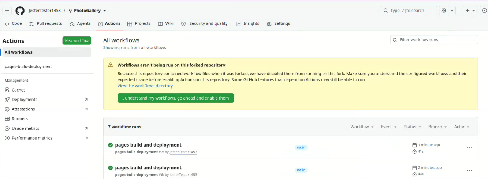

## Set up your gallery

1. **Fork this repository.**

2. **Allow the Action to commit back to your repo.**
   Go to **Settings → Actions → General → Workflow permissions** → select **"Read and write permissions"** → **Save**.
   *(Without this, the Action can run the script but can't push the updated `index.html` back — uploads will "silently" not appear.)*
   
   Since the repo is forked, we need to allow it in Actions for the repo too (click the green option):


4. **Turn on GitHub Pages.**
   Go to **Settings → Pages → Build and deployment → Source** → select **"Deploy from a branch"** → Branch: `main`, folder: `/ (root)` → **Save**.
   You will get an URL after a few minutes. 

5. **Personalize the basics** (optional but recommended):
   - Open `index.html` and update the `<title>` and header text.
   - Update the social links in the `.contact-icons` section (Instagram/Facebook/TikTok — delete any you don't use).
   - Swap out `favicon.ico`, `apple-touch-icon.png`, `favicon-32x32.png`, `favicon-16x16.png` for your own, or leave the defaults.
   - You can switch between `style1` and `style2`, or even write your own new styles — just edit this line in `index.html`:
```html
<link rel="stylesheet" href="styles/style1.css">
```
Change `style1.css` to `style2.css` (or your own custom stylesheet filename) to switch.


That's it — you're live. Your site will be at `https://<your-username>.github.io/<repo-name>/`.

---

## Adding photos to an existing album

1. On GitHub, navigate into `photos/<album-name>/` (e.g. `photos/travel/`).
2. Click **Add file → Upload files**.
3. Drag your image(s) in.
4. Scroll down, write a commit message, click **Commit changes** (commit directly to `main`).
5. Within ~30 seconds, check the **Actions** tab — you should see a green run called "Update Gallery". Once it's done, your site updates automatically.

Supported formats: `.jpg`, `.jpeg`, `.png`, `.gif`, `.webp`.

---

## Creating a brand-new album

GitHub's uploader doesn't have a "new folder" button — you create one by typing the folder into the filename:

1. Go into `/photos` (the top-level folder, not an existing album).
2. Click **Add file** and create a random txt file (you can delete it later). At the top you will see the file path and will be able to type newfolder/filename. This will create newfolder.
3. You can now come into neewfolder, add your photos and get rid of the starting file. If you try to remove the file first, you will lose the folder, because github does not track empty folders.
4. Commit


---

## Adding captions

After a photo has been added and the site has rebuilt once, find its `<figure>` block in `index.html` and add text between the empty `<figcaption></figcaption>` tags:

```html
<figcaption>Sunset over the harbor</figcaption>
```

Captions show on hover/tap. They will **never** be overwritten by future automated updates — the script only adds or removes entire `<figure>` blocks for photos that were added or deleted, and leaves every other block exactly as-is.

---

## Removing photos or albums

- **Remove a photo:** delete the file from its `/photos/<album>/` folder on GitHub. The next Action run removes its `<figure>` block (and its caption, since the photo is gone).
- **Remove an album entirely:** deleting the folder from `/photos` does **not** remove its section from `index.html` automatically (by design, to prevent accidental data loss, as there are limits to free hosting). Delete the album's `<div id="...">...</div>` block and its `<button>` from `index.html` by hand if you want it fully gone.

---

## Checking if it worked

1. Go to the **Actions** tab of your repo.
2. Find the latest **"Update Gallery"** run.
3. green = success, your site updated. red = something failed — click into it, expand the failing step, and read the error.

Common issues:
| Symptom | Likely cause |
|---|---|
| No workflow run appears at all | Your commit didn't touch anything inside `/photos`, or the workflow file isn't at `.github/workflows/update-gallery.yml` on `main` |
| Run fails at "Run gallery update script" with `Cannot find module` | The script filename in the workflow doesn't match the actual file in your repo |
| Run fails while pushing | "Read and write permissions" isn't enabled (see setup step 2) |
| Site doesn't update even though the run succeeded | Give GitHub Pages a minute to redeploy, then hard-refresh (Ctrl/Cmd+Shift+R) |
| Favicon doesn't show | Make sure icon `href`s in `<head>` don't start with a leading `/` — they should be relative (`favicon.ico`, not `/favicon.ico`), since GitHub Pages serves your site from a subpath, not the domain root |

---

## Local development (optional)

You don't need this for normal use — everything works through the GitHub website. But if you want to test locally:

```bash
node update-albums.js
```

This scans `/photos` and updates `index.html` exactly like the GitHub Action does, so you can preview changes before pushing.
